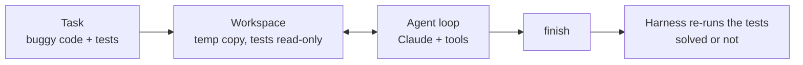

# Mini Coding Agent

A small coding agent, written from scratch, that fixes bugs the way a developer does: read the code, run the tests, make a minimal edit, run the tests again, and stop. It is benchmarked on [QuixBugs](https://github.com/jkoppel/QuixBugs) (40 Python programs, each with a one-line bug) and on six small firmware-flavored tasks, against a one-shot baseline that gets a single attempt with no tools.

```text
Task:  The command queue (RingBuffer) crashes after it has been in use for a while.
Agent: run_tests -> read_file -> replace_in_file -> run_tests (PASSED) -> finish
```

## How it works



| Piece | Details |
|---|---|
| **Workspace** (`workspace.py`) | A temporary copy of the task. Only the files marked editable can be written: tests, helpers and new files are refused, and paths cannot leave the workspace. Every test run has a timeout (30 s by default) because buggy code can loop forever. |
| **Tools** (`agent.py`) | `list_files`, `read_file` (with line numbers), `replace_in_file` (the old text must match exactly once), `write_file`, `run_tests`, `finish`. Edits return a diff, so the model sees exactly what changed. There is no shell tool. |
| **Loop** (`agent.py`) | Written by hand: a tool budget (15 calls by default), one reminder if the model replies in prose, a transcript of every step. |
| **Verdict** (`bench.py`) | After each attempt the harness runs the tests itself. Saying "done" does not count, and the report lists every case where the agent claimed success but the tests fail. |
| **One-shot ablation** | Same model, no loop. It sees the file, the tests and the failing output once, and returns one corrected file. |

Built-in tasks (`tasks/`): `crc8` (CRC-8 checksum), `ring_buffer` (command queue), `bitfield` (register fields), `wear_leveling` (block selection), `lru_cache` (mapping-page cache), `binary_search`. Each is a short bug report plus code and tests, and `tests/` checks that each bug is real and that its reference fix passes.

## Quickstart

```bash
pip install -r requirements.txt
python -m pytest                                   # offline tests; no API key needed
git clone https://github.com/jkoppel/QuixBugs data/QuixBugs
```

The agent uses the [Anthropic API](https://docs.anthropic.com/). Set `ANTHROPIC_API_KEY`, then:

```bash
python -m mini_agent.bench --suite builtin                        # the six built-in tasks
python -m mini_agent.bench --suite quixbugs --limit 5             # quick check
python -m mini_agent.bench --suite quixbugs                       # all 40 programs
python -m mini_agent.bench --suite quixbugs --method oneshot      # ablation
python -m mini_agent.bench --suite builtin --task crc8 --verbose  # watch one attempt
```

Useful flags: `--model` (default `claude-opus-5-5`), `--effort low|medium|high`, `--max-tool-calls`, `--timeout`. Each run writes `report.md`, `results.json`, and one record per task (transcript and final diff) under `runs/`. The printed cost is an estimate from a hard-coded price table.

## Results

**Harness check (no LLM).** All 40 QuixBugs programs fail their tests as shipped (3 of them hang until the timeout), and all 40 reference fixes from `correct_python_programs/` pass inside the workspace (QuixBugs commit `4257f44`).

<!-- Add the LLM results here after running them, e.g.
| Method | QuixBugs (40) | Built-in (6) | Mean tool calls | Said done but failed |
|---|---|---|---|---|
| Agent (claude-opus-5-5, medium) | x/40 | x/6 | x | x |
| One-shot | x/40 | x/6 | - | - |
and paste one short, real transcript from runs/ as an example. -->

## Design notes

- **The harness decides success, not the agent.** Coding agents sometimes report success when the tests still fail, so the benchmark measures that directly.
- **No reward hacking through the tests.** Tests are read-only and new files cannot be created, so the agent cannot edit the tests or add a `conftest.py` that skips them. The prompt also says not to special-case test inputs.
- **Small, safe tool surface.** There is no shell, so the only thing the agent can execute is the fixed test command. The code under test still runs locally, so use a container for anything untrusted.
- **Exact-match edits.** `replace_in_file` refuses ambiguous matches instead of guessing, which avoids silent edits in the wrong place.
- **Same building blocks as my [Paper Assistant Agent](https://github.com/ShengzheC/paper-assistant-agent) and [Ask My Papers](https://github.com/ShengzheC/ask-my-papers):** a hand-written tool loop, a strict schema for the final tool, prompt caching, saved transcripts, and offline tests with a scripted model.

## Limitations

- QuixBugs is small and public, so models may have seen it during training. Treat scores as a sanity check of the agent design, not as a capability measurement.
- All bugs are single-file and short. Real repositories also need code search, multi-file edits, and environment setup.

## License

MIT. QuixBugs is MIT-licensed by its authors and is downloaded separately; it is not included here.
